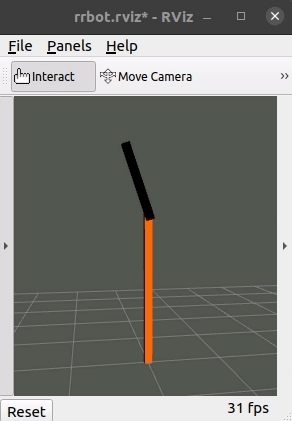

#  Reinforcement Learning Experiments on an Inverted Pendulum Simulation

This meta package contains ROS packages listed in the `.rosinstall` file to run a simulation and train an agent to control the inverted pendulum. Meant to be a sandbox for experimenting with reinforcement learning algorithms and techniques.



## Prerequisites

 - [torch](https://pytorch.org/get-started/locally/) (cpu version is fine)
 - ROS Noetic recommended for Python3 support.

## Setup

```shell
$ mkdir ~/catkin_ws
$ cd ~/catkin_ws
$ git clone https://github.com/dean4ta/rl_experiments src
$ cd ~/catkin_ws/src
$ wstool update
$ cd ~/catkin_ws
$ rosdep install --from-paths src --ignore-src -r -y
$ catkin_make
```

## Quick Start

Terminal 1
```shell
$ source devel/setup.bash
$ roslaunch rrbot_gazebo rrbot_world.launch rviz:=true
```

Terminal 2
```shell
$ source devel/setup.bash
$ rosrun inverted_pendulum_rl_control train_ddpg.py
```

## ROS Packages
see [`.rosinstall`](.rosinstall) for packages included in this meta package.